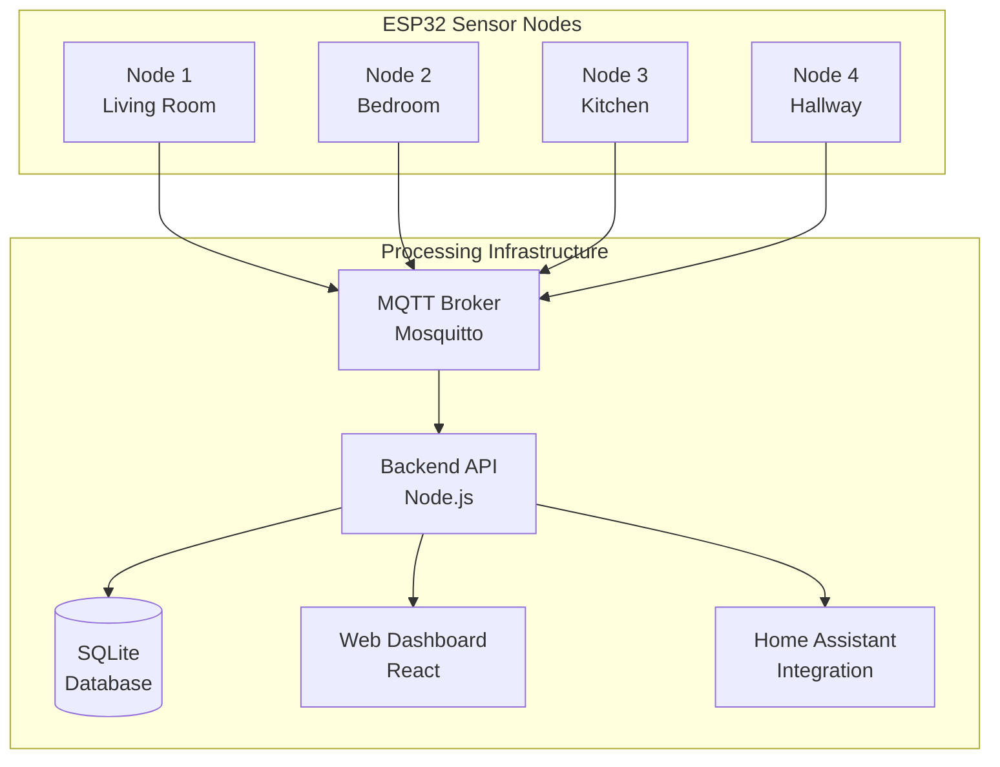

# WhōFi: WiFi CSI Indoor Positioning System

[](https://github.com/jedarden-org/whofi/actions/workflows/build-and-release.yaml)
[](https://github.com/jedarden-org/whofi/actions/workflows/ci-cd.yaml)
[](https://opensource.org/licenses/MIT)

A comprehensive ESP32-based WiFi Channel State Information (CSI) positioning system for accurate indoor location tracking and smart home automation.

## 🎯 What is WhōFi?

WhōFi is an advanced indoor positioning system that uses WiFi Channel State Information (CSI) to achieve **sub-meter accuracy** for device-free human tracking and smart home automation. The system leverages ESP32 microcontrollers to collect detailed WiFi signal characteristics, enabling precise position calculation without requiring users to carry any devices.

### Key Capabilities

- **Indoor Positioning**: 0.5-4m accuracy depending on configuration
- **Device-Free Tracking**: No smartphones or wearables required  
- **Real-Time Processing**: 400-600ms typical response time
- **Multi-Person Support**: Track 2-4 people simultaneously
- **Home Assistant Integration**: Native smart home automation
- **Privacy-First**: All processing done locally, no cloud dependency

## 🚀 Quick Start

### Using Pre-built Releases

1. **Download the latest release** from [Releases](https://github.com/jedarden-org/whofi/releases)
2. **Flash ESP32 firmware**:
   ```bash
   # Extract the firmware package
   tar -xzf whofi-firmware-*.tar.gz
   
   # Flash to ESP32
   esptool.py write_flash @flash_args
   ```

3. **Run with Docker Compose**:
   ```bash
   # Use pre-built images from GitHub Container Registry
   cd csi-server
   docker-compose -f docker-compose.prod.yml up -d
   ```

### Building from Source

```bash
# Clone the repository
git clone https://github.com/jedarden-org/whofi
cd whofi

# Build ESP32 firmware
cd csi-firmware
idf.py build

# Build and run server locally
cd ../csi-server
docker-compose up -d
```

## 🐳 Docker Images

Pre-built Docker images are available on GitHub Container Registry:

- **Backend**: `ghcr.io/jedarden-org/whofi-backend:latest`
- **Frontend**: `ghcr.io/jedarden-org/whofi-frontend:latest`

```bash
# Pull the latest images
docker pull ghcr.io/jedarden-org/whofi-backend:latest
docker pull ghcr.io/jedarden-org/whofi-frontend:latest
```

## 📊 System Architecture



## 🛠️ Hardware Requirements

### Minimal Setup (4 nodes, ~800 sqft)
- **ESP32 Modules**: 4x ESP32-S3-WROOM-1 ($32-48)
- **Antennas**: 4x external 2.4GHz antennas ($60)
- **Infrastructure**: Network switch, cables ($75)
- **Total Cost**: $167-183

### Professional Setup (6 nodes, ~1200 sqft)
- **ESP32 Modules**: 6x ESP32-S3 with enhanced timing ($48-72)
- **Antennas**: 6x high-gain external antennas ($90)
- **Infrastructure**: Professional networking equipment ($150)
- **Total Cost**: $288-312

## 🏠 Home Assistant Integration

### Device Configuration

```yaml
# ESPHome configuration for WhōFi nodes
esphome:
  name: whofi-node-living-room
  platform: ESP32
  board: esp32-s3-devkitc-1

sensor:
  - platform: custom
    lambda: |-
      auto csi_sensor = new CSISensor();
      App.register_component(csi_sensor);
      return {csi_sensor};
    sensors:
      - name: "Position X"
      - name: "Position Y"
      - name: "RSSI"

mqtt:
  broker: homeassistant.local
  topic_prefix: whofi/${device_name}
```

## 📚 Documentation

- **[Technical Overview](esp32_csi/docs/ESP32_CSI_Technical_Overview.md)** - ESP32 CSI fundamentals
- **[Hardware Setup](esp32_csi/specs/Hardware_Requirements.md)** - Detailed hardware specifications
- **[Server Guide](csi-server/README.md)** - Complete server infrastructure
- **[API Documentation](csi-server/backend/README.md)** - REST API reference

## 🔒 Privacy & Security

- **Local Processing**: All calculations done on-premises
- **No Cloud Dependency**: Complete offline operation
- **Encrypted Communication**: WPA3 and MQTT TLS support
- **Open Source**: Full code transparency

## 🤝 Contributing

We welcome contributions! Please see our [Contributing Guidelines](CONTRIBUTING.md) for details.

### Development Areas
- **Algorithm Improvements**: Enhanced positioning accuracy
- **Hardware Support**: New ESP32 variants and sensors
- **Integration Modules**: Additional smart home platforms
- **Mobile Applications**: iOS/Android configuration apps

## 📄 License

This project is licensed under the MIT License - see the [LICENSE](LICENSE) file for details.

## 🙏 Acknowledgments

Based on research from:
- Avola, D., et al. (2025): "WhoFi: Deep Person Re-Identification via Wi-Fi CSI" 
- Multiple IEEE and ACM publications on WiFi CSI positioning

## 📞 Support

- **Issues**: [GitHub Issues](https://github.com/jedarden-org/whofi/issues)
- **Discussions**: [GitHub Discussions](https://github.com/jedarden-org/whofi/discussions)
- **Documentation**: [Full Docs](https://github.com/jedarden-org/whofi/tree/main/docs)

---

**WhōFi** - Bringing enterprise-grade indoor positioning to everyone 🚀

*Built with ❤️ for the open-source smart home community*