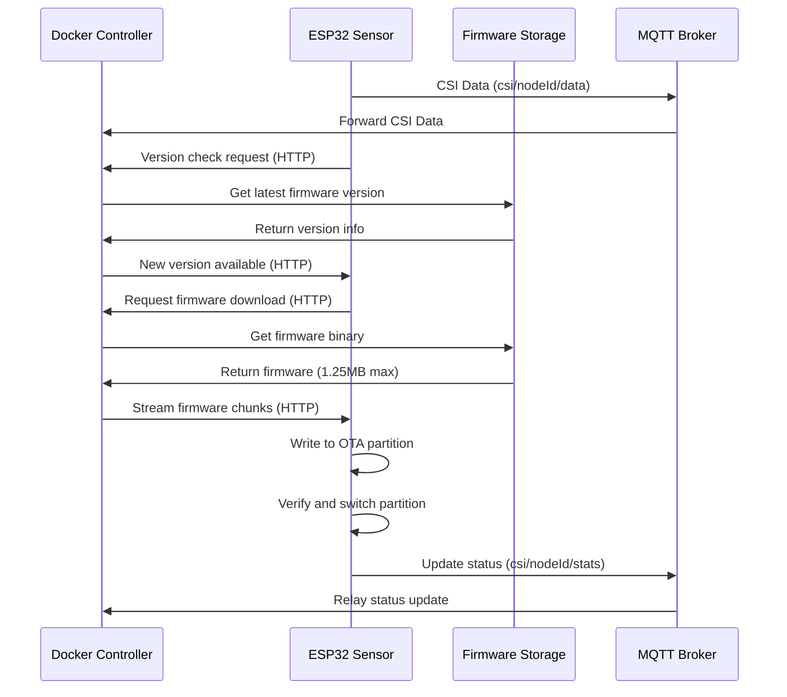
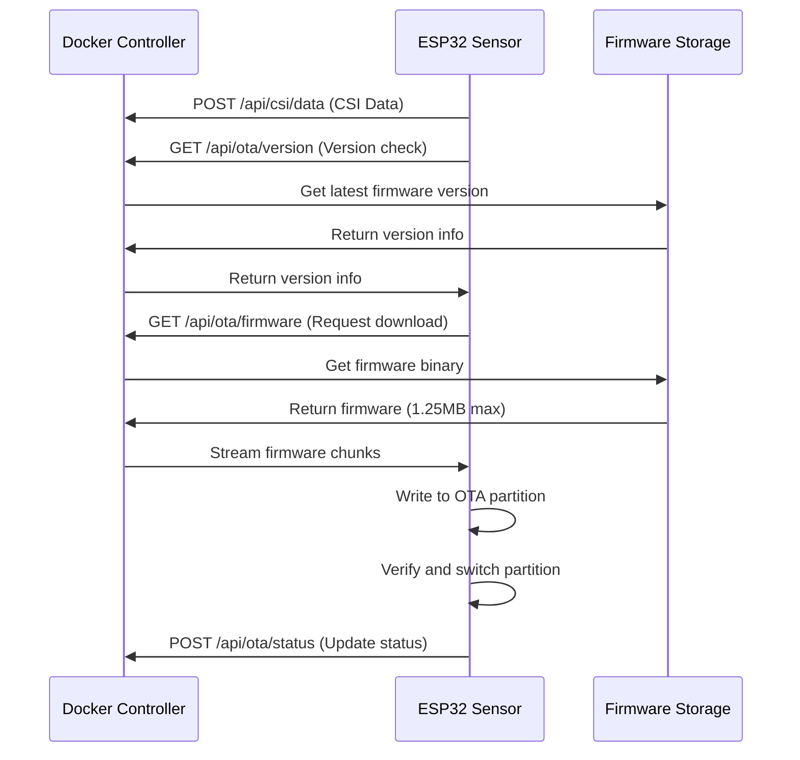

# CSI Sensor OTA Deployment Guide

## 📦 OTA Payload Size Analysis

### ✅ **Maximum App Size with OTA: 1.25MB (1,310,720 bytes)**

Based on ESP32-S3 OTA partition constraints and our research:

- **OTA Partition Size**: 1.25MB per slot (industry standard)
- **Dual Slot Requirement**: OTA_0 and OTA_1 (2.5MB total for apps)
- **Flash Memory Required**: 4MB minimum (8MB/16MB recommended)
- **Available Storage**: 1.4MB SPIFFS for configuration and logs

## 🎯 Docker-Controlled OTA Deployment Strategy

### 🔍 **Communication Protocol Analysis**

**Current Implementation: MQTT-based**
- CSI data transmitted via MQTT to Docker server
- Server subscribes to `csi/+/data`, `csi/+/stats`, `csi/+/heartbeat`
- Mosquitto broker runs in Docker container

**Alternative Option: HTTP-based** 
- CSI data transmitted directly via HTTP POST to Docker server
- No MQTT broker required, simpler architecture
- Direct RESTful API communication

### Deployment Architecture

#### **Option A: Current MQTT Architecture**
```
┌─────────────────┐    MQTT Data     ┌─────────────────┐    OTA Update    ┌─────────────────┐
│ Docker Container│ ◄───────────────  │   ESP32-S3      │ ◄───────────────│ Firmware Server │
│ + MQTT Broker   │                  │   CSI Sensors   │    (HTTP/HTTPS)  │  (Docker-based) │
└─────────────────┘                  └─────────────────┘                 └─────────────────┘
         │                                     │                                     │
         │                                     │                                     │
         ▼                                     ▼                                     ▼
   MQTT Subscribe             CSI Data via MQTT (1883)              Version Management
   csi/+/data                                                       & Binary Storage
```

#### **Option B: HTTP-Only Architecture**
```
┌─────────────────┐   HTTP POST CSI  ┌─────────────────┐    OTA Update    ┌─────────────────┐
│ Docker Container│ ◄───────────────  │   ESP32-S3      │ ◄───────────────│ Firmware Server │
│  (REST API)     │   /api/csi/data  │   CSI Sensors   │    (HTTP/HTTPS)  │  (Docker-based) │
└─────────────────┘                  └─────────────────┘                 └─────────────────┘
         │                                     │                                     │
         │                                     │                                     │
         ▼                                     ▼                                     ▼
   RESTful Endpoints         CSI Data via HTTP (3000)               Version Management
   /api/csi/data                                                    & Binary Storage
```

### 🔧 Implementation Components

#### 1. **ESP32 OTA Client (Firmware)**
```c
// OTA configuration for Docker-managed updates
typedef struct {
    char update_url[256];           // Docker container endpoint
    char version_check_url[256];    // Version comparison endpoint  
    uint32_t check_interval_sec;    // Update check frequency
    bool auto_update_enabled;       // Enable automatic updates
    char device_id[32];            // Unique device identifier
    char auth_token[128];          // Authentication for updates
} ota_deployment_config_t;
```

#### 2. **Docker Controller Service**
```yaml
# docker-compose-ota.yml
version: '3.8'
services:
  ota-controller:
    image: csi-ota-controller:latest
    ports:
      - "8080:8080"    # OTA update endpoint
      - "8081:8081"    # Management interface
    environment:
      - FIRMWARE_STORAGE_PATH=/firmware
      - DEVICE_REGISTRY_DB=postgresql://...
      - UPDATE_STRATEGY=gradual_rollout
    volumes:
      - ./firmware:/firmware
      - ./config:/config
    depends_on:
      - postgres
      - redis
```

## 📊 Payload Size Optimization

### Current Firmware Analysis
```bash
# Check current build size
idf.py build
./check_firmware_size.sh

# Expected results with OTA configuration:
# App size: ~800KB - 1MB (well within 1.25MB limit)
# OTA overhead: ~50KB
# Available headroom: ~250-450KB for future features
```

### Size Optimization Techniques
1. **Compiler Optimizations**: `-Os` size optimization enabled
2. **Feature Reduction**: Disable unused ESP-IDF components  
3. **Library Optimization**: Use minimal versions of libraries
4. **Code Splitting**: Move large features to SPIFFS when possible

## 🚀 Docker-Based OTA Controller Implementation

### OTA Controller Features

#### **Firmware Management**
- ✅ **Version Control**: Semantic versioning with rollback capability
- ✅ **Progressive Rollout**: Deploy to subsets of devices first
- ✅ **Health Monitoring**: Monitor device status during updates
- ✅ **Automatic Rollback**: Revert on update failures

#### **Device Management**  
- ✅ **Device Registry**: Track all deployed CSI sensors
- ✅ **Configuration Management**: Push config updates via OTA
- ✅ **Status Monitoring**: Real-time device health and connectivity
- ✅ **Batch Operations**: Update multiple devices simultaneously

#### **Security & Reliability**
- ✅ **Signed Firmware**: Cryptographic signature verification
- ✅ **Encrypted Transport**: HTTPS for firmware downloads
- ✅ **Authentication**: Device-specific tokens for updates
- ✅ **Integrity Checking**: SHA256 verification of downloads

### 🔄 Communication Protocol Decision Matrix

| Feature | MQTT Architecture | HTTP Architecture |
|---------|-------------------|-------------------|
| **Setup Complexity** | Higher (requires MQTT broker) | Lower (direct REST API) |
| **Resource Usage** | More containers (Mosquitto) | Fewer containers |
| **Real-time Updates** | Excellent (pub/sub) | Good (polling/websockets) |
| **Payload Size** | Optimized for small messages | Better for larger payloads |
| **Network Reliability** | Built-in QoS levels | Manual retry logic |
| **Current Implementation** | ✅ **Implemented** | ⚠️ Requires modification |

### 🔄 OTA Update Process Flow

#### **Current MQTT Flow**


#### **Alternative HTTP-Only Flow**


## 📋 Deployment Configuration Files

### **ESP32 OTA Configuration**
```c
// In main application
#include "esp_ota_ops.h"
#include "esp_https_ota.h"

// OTA configuration
const ota_deployment_config_t ota_config = {
    .update_url = "https://ota-controller.local:8080/firmware/latest",
    .version_check_url = "https://ota-controller.local:8080/version",
    .check_interval_sec = 3600,  // Check hourly
    .auto_update_enabled = true,
    .device_id = "csi_sensor_001",
    .auth_token = "device_specific_token_here"
};
```

### **Docker Controller Environment**
```bash
# OTA Controller Configuration
FIRMWARE_MAX_SIZE=1310720     # 1.25MB limit
DEVICE_UPDATE_BATCH_SIZE=5    # Update 5 devices at a time
ROLLBACK_TIMEOUT_MIN=30       # Auto-rollback after 30 min if unhealthy
UPDATE_RETRY_COUNT=3          # Retry failed updates 3 times
HEALTH_CHECK_INTERVAL_SEC=300 # Check device health every 5 minutes
```

## 🎯 Production Deployment Strategy

### **Phase 1: Infrastructure Setup**
1. Deploy Docker-based OTA controller
2. Configure firmware storage and versioning
3. Set up device registry and authentication
4. Test with single device

### **Phase 2: Gradual Rollout**  
1. Deploy to 10% of devices first
2. Monitor health and performance for 24 hours
3. Gradually increase to 50%, then 100%
4. Maintain rollback capability throughout

### **Phase 3: Automated Operations**
1. Enable automatic update checks
2. Configure update schedules (off-peak hours)
3. Set up alerting for failed updates
4. Implement self-healing mechanisms

## 📊 Expected Performance

### **Update Characteristics**
- **Download Time**: 2-5 minutes (1.25MB over WiFi)
- **Update Process**: 30-60 seconds (flash write + verification)
- **Rollback Time**: 10-20 seconds (partition switch)
- **Total Downtime**: <2 minutes per device

### **Scalability**  
- **Concurrent Updates**: 20-50 devices simultaneously
- **Network Bandwidth**: ~250KB/s per device during updates
- **Storage Requirements**: ~10GB for 100 firmware versions
- **Database Load**: Minimal (device status tracking)

## 🔒 Security Considerations

### **Firmware Security**
- ✅ **Code Signing**: All firmware binaries cryptographically signed
- ✅ **Secure Boot**: Optional ESP32-S3 secure boot chain
- ✅ **Encrypted Storage**: NVS encryption for sensitive data
- ✅ **Network Security**: TLS 1.3 for all communications

### **Infrastructure Security** 
- ✅ **Container Security**: Docker containers with minimal privileges
- ✅ **Network Isolation**: Internal Docker networks for services
- ✅ **Authentication**: JWT tokens for device authentication
- ✅ **Audit Logging**: All update activities logged

## 🏆 Summary

**OTA Payload Capacity**: **1.25MB per firmware update**
- Sufficient for current CSI firmware (~800KB-1MB)
- ~250-450KB headroom for future features
- Dual partition system ensures safe updates
- Docker-controlled deployment enables enterprise-grade management

This OTA configuration provides reliable, secure, and scalable firmware updates for deployed CSI sensors while maintaining the positioning accuracy and real-time performance requirements.